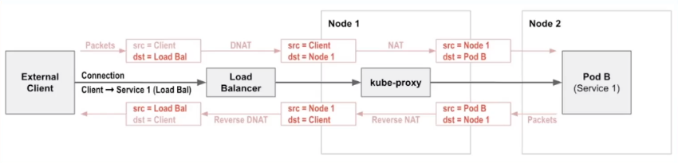

# Calico Encryption & eBPF
Demo using EKS cluster for WireGuard and eBPF. This demo will deploy an EKS cluster using Ubuntu 20.04LTS nodes to support eBPF. The AWS VPC CNI will be used with Calico Enterprise installed after initial provisioning.

## Create EKS Cluster

1. Deploy EKS cluster

Compatible Ubuntu AMI images can be found [here](https://cloud-images.ubuntu.com/aws-eks/). Ensure you use the correct AMI for your region.

```bash
# set variables
export CLUSTER_NAME=<cluster name>
export KEYPAIR_NAME=<aws keypair>
export AWS_REGION=<aws region>

# create config file for cluster creation

cat > configs/eks-cluster.yaml << EOF
apiVersion: eksctl.io/v1alpha5
kind: ClusterConfig

metadata:
  name: "$CLUSTER_NAME"
  region: "$AWS_REGION"
  version: "1.20"

#availabilityZones: ["", "", ""]

managedNodeGroups:
- name: "ng-m5-large"
  ami: "ami-006df5a9e91a213e3"
  desiredCapacity: 2
  # choose proper size for worker node instance as the node size detemines the number of pods that a node can run
  # it's limited by a max number of interfeces and private IPs per interface
  # t3.large has max 3 interfaces and allows up to 12 IPs per interface, therefore can run up to 36 pods per node
  # see: https://docs.aws.amazon.com/AWSEC2/latest/UserGuide/using-eni.html#AvailableIpPerENI
  instanceType: "m5.large"
  ssh:
    # uncomment lines below to allow SSH access to the nodes using existing EC2 key pair
    publicKeyName: $KEYPAIR_NAME
    allow: true
  overrideBootstrapCommand: |
      #!/bin/bash
      /etc/eks/bootstrap.sh $CLUSTER_NAME
# enable all of the control plane logs:
cloudWatch:
  clusterLogging:
    enableTypes: ["*"]
EOF    
```
Substitute variable into the YAML file and create cluster

```bash
sed -i "" "s/\$CLUSTER_NAME/${CLUSTER_NAME}/g" configs/eks-cluster.yaml
sed -i "" "s/\$KEYPAIR_NAME/${KEYPAIR_NAME}/g" configs/eks-cluster.yaml
sed -i "" "s/\$AWS_REGION/${AWS_REGION}/g" configs/eks-cluster.yaml

# Check eks-cluster.yaml has correct variable and create cluster
eksctl create cluster -f configs/eks-cluster.yaml
```

2. Update `kubeconfig` to access the cluster

```bash
aws eks update-kubeconfig --name $CLUSTER_NAME --region $AWS_REGION
```

3. Confirm connectivity to cluster and confirm OS Image on the nodes

```bash
kubectl get nodes -owide
```
>Output will be similar to:
```
NAME                                           STATUS   ROLES    AGE     NAME                                           STATUS   ROLES    AGE     VERSION   INTERNAL-IP      EXTERNAL-IP     OS-IMAGE             KERNEL-VERSION   CONTAINER-RUNTIME
ip-192-168-43-178.us-west-2.compute.internal   Ready    <none>   7m16s   v1.21.2   192.168.43.178   35.81.80.144    Ubuntu 20.04.3 LTS   5.8.0-1042-aws   docker://20.10.7
ip-192-168-5-207.us-west-2.compute.internal    Ready    <none>   7m16s   v1.21.2   192.168.5.207    34.214.72.197   Ubuntu 20.04.3 LTS   5.8.0-1042-aws   docker://20.10.7
```

4. Install Calico Enterprise
Install Calico Enterprise as per [documentation](https://docs.tigera.io/getting-started/kubernetes/eks).
<br>


## Deploy YaoBank app and Demo IP Tables

Deploying a simple application *Yet Another Online Bank* and show how the Client or Source IP address is not preserved through to the target server

1. Install YAOBANK

```bash
kubectl apply -f https://raw.githubusercontent.com/tigera/ccol2aws/main/yaobank.yaml
```

2. Set variables for later use

```bash
export CUSTOMER_POD2=$(kubectl get pods -n yaobank -l app=customer -o name)
export SUMMARY_POD2=$(kubectl get pods -n yaobank -l app=summary -o name | head -n 1)
echo "export CUSTOMER_POD2=${CUSTOMER_POD2}" >> ccol2awsexports.sh
echo "export SUMMARY_POD2=${SUMMARY_POD2}" >> ccol2awsexports.sh
```

3. Deploy ELB for Frontend Customer Pod

```bash
kubectl apply -f - <<EOF
apiVersion: v1
kind: Service
metadata:
  name: yaobank-customer
  namespace: yaobank
spec:
  selector:
    app: customer
  ports:
    - port: 80
      targetPort: 80
  type: LoadBalancer
EOF
```
>Confirm Loadbalancer Service is created and obtain External Hostname

```bash
kubectl get svc -n yaobank yaobank-customer
```
> Output will resemble:
```bash
NAME               TYPE           CLUSTER-IP       EXTERNAL-IP                                                               PORT(S)        AGE
yaobank-customer   LoadBalancer   10.100.244.246   a6b6d85f2678544f6be5abcb8f62adb6-1743370275.us-west-1.elb.amazonaws.com   80:31239/TCP   81s
```

4. Connect to the Customer Pod via the ELB from local terminal

Remember to change the hostname to target the correct ELB VIP

```bash
curl a6b6d85f2678544f6be5abcb8f62adb6-1743370275.us-west-1.elb.amazonaws.com
```

5. Review the logs on the Customer Pod

```bash
kubectl logs -n yaobank $CUSTOMER_POD2
```
>Example Output:
```
 * Running on http://0.0.0.0:80/ (Press CTRL+C to quit)
192.168.46.192 - - [05/Oct/2021 23:17:12] "GET / HTTP/1.1" 200 -
192.168.46.192 - - [05/Oct/2021 23:17:55] "GET / HTTP/1.1" 200 -
```
Note the Source IP is the NATed IP of Kube Proxy. This is required so return traffic from the target pod is routed back to the correct kube-proxy on the Node which received the initial flow.




6. Cleanup for eBPF

As we will preserve the Client IP address we will delete the ELB first

```bash
kubectl delete service yaobank-customer -n=yaobank
```

Next steps: [Enabling eBPF](./modules/eBPF.md)


