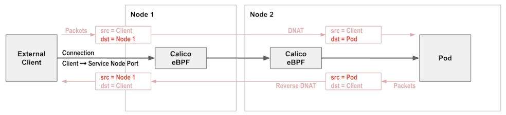

# Enabling eBPF

1. Enable direct access to Kubernetes API

The eBPF dataplane replaces kube-proxy. However, in a non-eBPF cluster, Calico uses a service hosted by kube-proxy to access the Kubernetes API server. As a result, we need to reconfigure Calico to tell it to talk directly to the Kubernetes API server. It will need equal access to Kubernetes resources that kube-proxy has in order to replace that functionality:

```bash
kubectl get configmap -n kube-system kube-proxy -o jsonpath='{.data.kubeconfig}' | grep server
```
>Example Output:
```
server: https://66d627cde14cf23ea671218e6fc756bd.yl4.us-west-1.eks.amazonaws.com
```

2. Create configmap for calico-node to know how to contact Kubernetes API server

```bash
kubectl apply -f - <<EOF
kind: ConfigMap
apiVersion: v1
metadata:
  name: kubernetes-services-endpoint
  namespace: kube-system
data:
  KUBERNETES_SERVICE_HOST: "66d627cde14cf23ea671218e6fc756bd.yl4.us-west-1.eks.amazonaws.com"
  KUBERNETES_SERVICE_PORT: "443"
EOF
```
Wait for 60s as reported in [Kubernetes issue 30189](https://github.com/kubernetes/kubernetes/issues/30189)

3. Restart calico-system pods to enable direct communication to Kubernetes API

```bash
kubectl delete pods -n calico-system --all
```

>Verify all pods restart successfully

```bash
kubectl get pods -n calico-system
```
>Output should resemble:
```
NAME                                          READY   STATUS    RESTARTS   AGE
calico-kube-controllers-8464c55484-9k9n9      1/1     Running   1          3m
calico-node-lbvn6                             1/1     Running   0          2m55s
calico-node-st2c4                             1/1     Running   0          2m51s
calico-typha-74f8c895bd-j4wg5                 1/1     Running   0          2m59s
calico-typha-74f8c895bd-sxf8m                 1/1     Running   0          2m59s
es-calico-kube-controllers-6f79ff7c48-d2tlh   1/1     Running   1          2m59s
```
4. Replace kube-proxy

Now that Calico can communicate directly with the eBPF endpoint, we can enable eBPF mode to replace kube-proxy. To do this, we can patch kube-proxy to use a non-calico node selector. By doing so, we’re telling kube-proxy not to run on any nodes (because they’re all running Calico):

```bash
kubectl patch ds -n kube-system kube-proxy -p '{"spec":{"template":{"spec":{"nodeSelector":{"non-calico": "true"}}}}}'
```

>Verify kube-proxy is no longer running

```bash
kubectl get pods -n kube-system
```

We can see kube-proxy is no longer running. Kubernetes will now use Calico's native service handling once Felix is patched

5. Enable eBPF on Felix

```bash
calicoctl patch felixconfiguration default --patch='{"spec": {"bpfEnabled": true}}'
```

May need to use the `--allow-version-mismatch` flag if `calicoctl` client version does not match the cluster version

6. Restart DNS

When the dataplane changes, it disrupts any existing connections, and as a result it’s a good idea to replace the pods that are running. In our specific case, deleting the kube-dns pods will ensure that connectivity for these pods is running fully on the eBPF dataplane, as these pods are integral to Kubernetes functionality:

```bash
kubectl delete pod -n kube-system -l k8s-app=kube-dns
```

>Verify DNS pods restart successfully:

```bash
kubectl get pods -n kube-system | grep coredns
```

7. Redeploy Yaobank app

```bash
kubectl delete pods -n yaobank --all

#Reset the variables for later use
export CUSTOMER_POD2=$(kubectl get pods -n yaobank -l app=customer -o name)
export SUMMARY_POD2=$(kubectl get pods -n yaobank -l app=summary -o name | head -n 1)
```

8. Enable Source IP Preservation with eBPF and an NLB

Now, we will deploy an NLB to act as the frontend for our customer pod, instead of an ELB

```bash
kubectl apply -f - <<EOF
apiVersion: v1
kind: Service
metadata:
  name: yaobank-customer
  namespace: yaobank
  annotations:
    service.beta.kubernetes.io/aws-load-balancer-type: "nlb"
spec:
  selector:
    app: customer
  ports:
    - port: 80
      targetPort: 80
  type: LoadBalancer
EOF
```

>Check the Service is created and obtain the external hostname of the NLB VIP

```bash
kubectl get svc -n yaobank yaobank-customer
```

>Example output:

```
NAME               TYPE           CLUSTER-IP      EXTERNAL-IP                                                                     PORT(S)        AGE
yaobank-customer   LoadBalancer   10.100.23.108   a3407c3aaac984a069c2847bc3d090bf-9ae620ea8fb0369c.elb.us-west-1.amazonaws.com   80:32474/TCP   12s
```

9. Test Connectivity and Validate Source IP

```bash
# curl the NLB VIP
curl a3407c3aaac984a069c2847bc3d090bf-9ae620ea8fb0369c.elb.us-west-1.amazonaws.com

# Review logs from the frontend customer pod
kubectl logs -n yaobank $CUSTOMER_POD2
```

>Example output:
```
 * Running on http://0.0.0.0:80/ (Press CTRL+C to quit)
162.158.144.68 - - [06/Oct/2021 17:40:19] "GET / HTTP/1.1" 200 -
```

We can see that a public IP address is now logged which confirms Direct Server Return and Calico's eBPF service handling is preserving the client IP address 


<br>
<br>

Next steps: [WireGuard Encryption](./modules/wireguard-encryption.md)